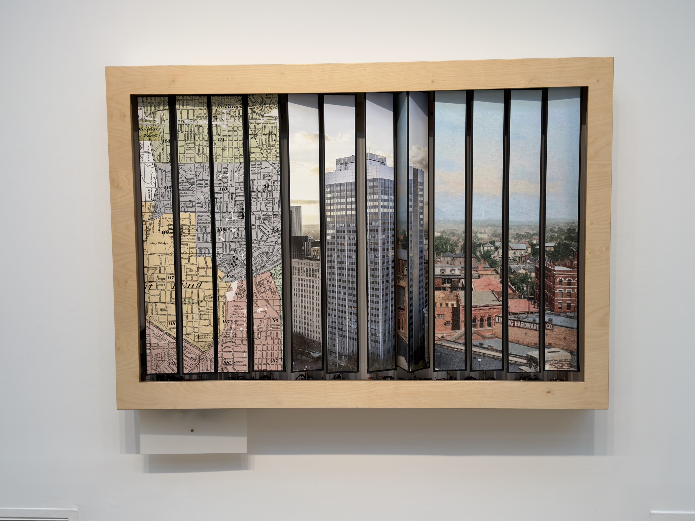

# Trivision Kinetic Sculpture



I found an 1895 carte-de-visite made about 800 feet away from Atlanta's "zero
mile post" which marked the founding spot of the city in 1837, and directly over
the site of Jacobs' Pharmacy where Coca-Cola was first served in 1886. A now
unknown photographer made the view from the rooftop of the now-demolished
original Equitable Building in Atlanta's Five Points. To capture the same
viewpoint, I had to figure out the rooftop height of that long-gone building,
and fly a drone camera to that elevation. The alignment of my 2025 photograph
with the 1895 postcard is almost perfect, yet there is almost no architectural
legacy left from the original scene, so I have paired the two photographs with
a map so the viewer can orient themselves.

Making the images rotate in the style of a 1950s trivision billboard came to me
when I was commissioned to create a 40 foot long immersive hallway for Hambidge
Hive in 2025. I created a zigzag in the style of a tabula scalata, an illusion
dating from the 16th century in which an image is painted on two faces of a
zigzag frame so that the picture seems to change from one image to another
while walking past it. I was happy/not happy with the result. I liked the idea
of activating an installation with the viewer's own participation. But I
wondered if a tabula scalata could reveal itself, and remembered vaguely that
in the 1950s there were "trivision" billboards on the highways that rotated ads
on prisms, the first "digital display" in history.

It took me six months of feverish work to figure out how to make the 12 motors
work in sync, and designing and fabricating the massive intricate plywood
cabinet it is housed in turned out to be one of the most fiendishly difficult
technical challenges of my studio career.

— Joel Silverman

## The sculpture

Twelve triangular prisms in a row, each carrying strips of three photographic
images, each turned by its own stepper motor inside a CNC-fabricated wooden
frame. As the prisms rotate — slowly, silently, in choreographed patterns — the
sculpture dissolves between three photographs; when all twelve prisms land on
the same face, a single panorama spans the full width.

A kinetic artwork by [Joel Silverman](https://joelsilverman.com), Atlanta,
choreographed like a musical score. Current image sets: *Blind Willie McTell*,
*Barnard Gulch*, and *Oakland Magnolia*.

## How it works

**Choreography is authored in Blender.** Each prism is a keyframed object in a
Blender scene; the animation curves are extracted and converted into integer
step/timing tables (`steps = degrees/360 × 3200` at 1/8 microstepping, 24 fps
timebase) that compile straight into the Arduino firmware.

**One Arduino Mega 2560 drives all twelve motors.** Each prism has a NEMA 17
stepper (0.9°/step) on a TMC2209 silent driver. The proven motion architecture
runs a 50 µs Timer1 interrupt with integer S-curve acceleration tables and
direct port-register step pulses — no floating point and no `digitalWrite` in
the hot loop — so twelve axes stay smooth and the gallery stays quiet. Motion
is deliberately gentle: the authorized ceiling is 1 RPM.

**Power:** Mean Well LRS-150-24 supplies the motor rail; a buck converter feeds
the Mega. Full electronics detail, pin assignments, and the development history
live in `ARDUINO/TrivisionHandoff.md` — the canonical spec for this project.

## Repository contents

```
ARDUINO/                     all firmware, forked by version, never overwritten:
                             TrivisionChoreo_v7_* (live choreography family),
                             TrivisionHWTest_* (bring-up tests),
                             TrivisionCascade_* (4-motor prototype era),
                             plus motion simulators and TrivisionHandoff.md
CNC Fabrication Plans/       DXF/SVG cut files for the frame
ILLUSTRATOR FILES FOR CNC/   vector source for the cut files
Woodworking Frame Plans/     frame joinery drawings
3D Printing Files/           printed brackets and fittings
Stepper Motor 17HM19-2004S/  motor documentation and CAD
Trivision Kinetic Sculpture Manual-2.pdf   the printed manual
```

This repository tracks code, fabrication plans, and documentation. The heavy
project media (Blender scenes, photographic scans, renders, video) lives
outside git.

The wooden housings were cut with a companion tool also on GitHub:
[CNC-boxcreator](https://github.com/silvermanphoto/CNC-boxcreator), which
generates the CNC toolpath SVGs for the frame boxes.

## Status

A 4-motor prototype has verified the full motion architecture end to end
(smooth S-curve starts and stops at sub-1-RPM speeds, no resonance, inaudible
at gallery distance). The 12-motor firmware expansion and hall-sensor homing
are the active fronts; see `ARDUINO/TrivisionHandoff.md` for the roadmap.
